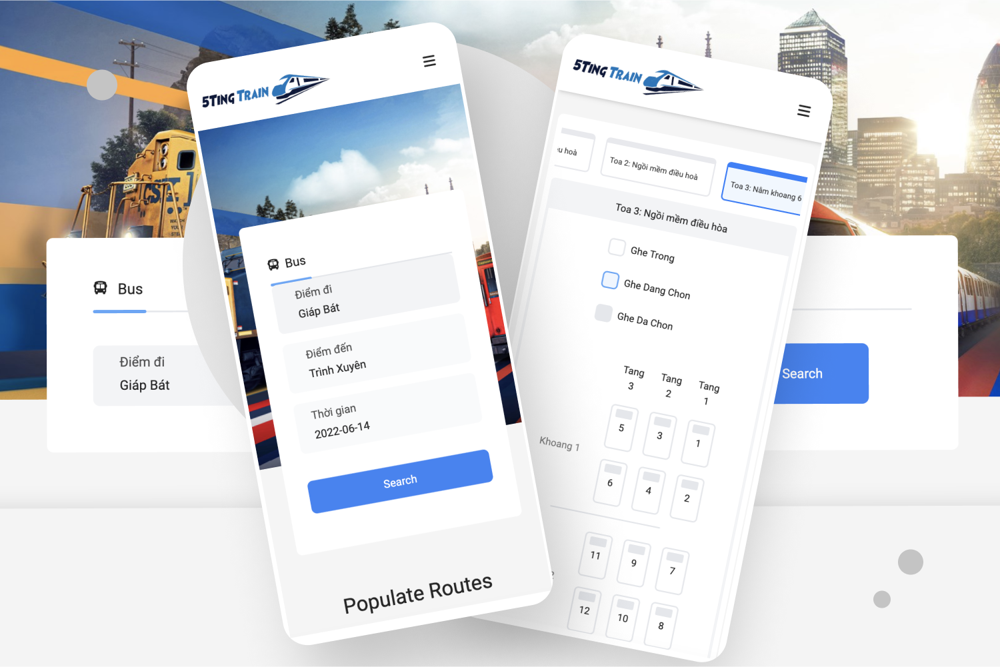

# Ticket-Manger

  

# Main features

TicketManager is a website that helps users easily book train tickets on pc, mobile device. It also help enterprises to easily manage train tickets.

## User

- Search train ticket
- Booking train ticket
- Manage booked ticket, profile,...

## Admin

- Dashboard
- Manager ticket, train, enterprise, user, wagon
- Analysic revenue, system status,...
- Settings, regulations

# Tech stack

- Front end: ReactJS, TailwindCSS, AntDesign
- State management: Redux, Redux Thunk, Redux Tookit
- Back end: NodeJS, ExpressJS, Mongoose
- Database/Cloud: MongoDB

# Demo

- Visit one of below:
  - Client: https://hl-ticketmanager.netlify.app/
  - Admin: https://admin-ticketmanager.netlify.app/
- Account for admin:
  email: hongadmin@gmail.com
  password: 123123

# Contact

Contact me at this email: lamvanhongvn@gmail.com. Thank you!!
